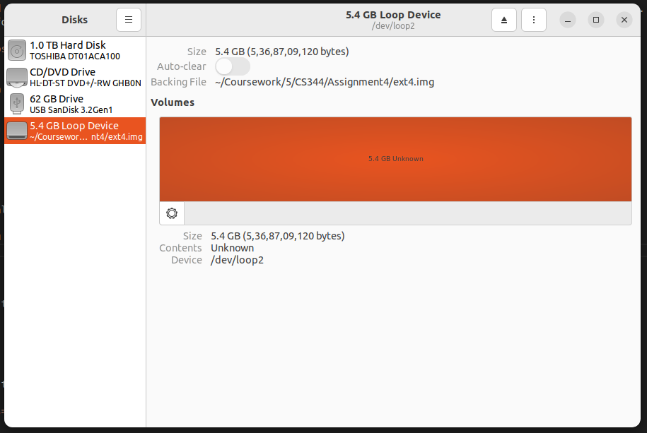
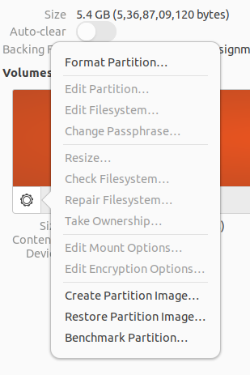
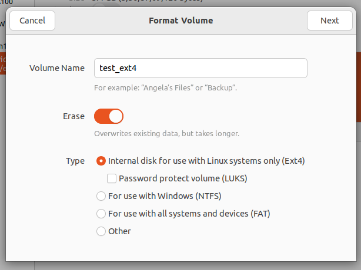
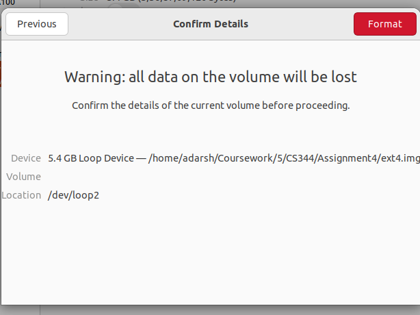
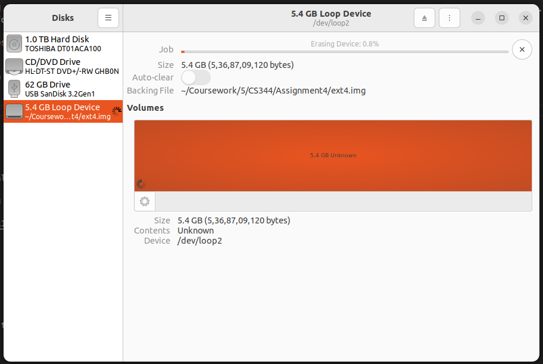
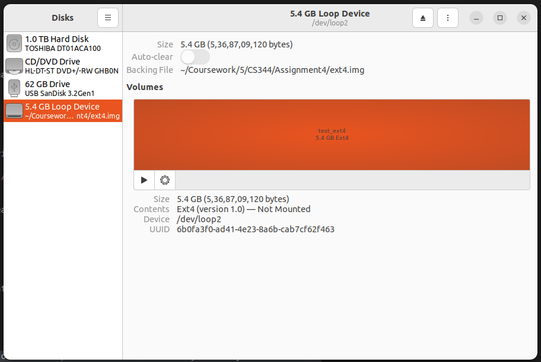
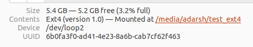

# Comparision of ZFS and ext4 FS on basis of Data Deduplication and Large File Handling
## Assignment 4 CS344 Group 6
Submission by:
- Adarsh Gupta (220101003)
- Aditya Nanda (220101006)
- Aryan Raj (220101019)
- Ashish Raj (220101020)

The following filesystems were used:
- ext4
- ZFS

to compare the following features:
- Large File Creation and Management 
- Data Deduplication

using vdbench workloads.

## Installation and Drive Setup
This section covers how to create a disk of size 5GB with ZFS or ext4 fs, and how to find its anchors for later mounting.

###  ext4
ext4 is the default file system used by Ubuntu. So all we need to do is create a new virtual hard disk with this filesystem and find its anchor.
1. Create a virtual disk using the following command:
```bash
sudo dd if=/dev/zero of=./ext4.img bs=1M count=5120
```

2. Map the virtual disk created to a loop device
```bash
sudo losetup -fP --show ./ext4.img
```

3. Find the anchor point
```bash
losetup -j ./ext4.img
```
In my case, /dev/loop21 is the virtual disk and /dev/loop21 is the mount point of the loop device.

4. Go to Ubuntu Disk Utility and you should find your newly created disk there



5. Format partition as ext4






6. Mount the partition by clicking on the play button



7. The mount point displayed is the anchor point of this device, export this for later use



```bash
export EXT4_ANCHOR=/media/adarsh/test_ext4
```

### ZFS
To setup a ZFS filesystem, you need to follow the following steps:
1. Install ZFS Utilities
```bash
sudo apt install zfsutils-linux -y
```

2. Next create a virtual disk using the following command:
```bash
sudo dd if=/dev/zero of=./zfs.img bs=1M count=5120
```

3. Map the virtual disk created to a loop device
```bash
sudo losetup -fP --show ./zfs.img
```

4. Find the anchor point
```bash
losetup -j ./zfs.img
```
In my case, /dev/loop22 is the virtual disk and /dev/loop22 is the mount point of the loop device.

5. Unmount the device
```bash
sudo umount /dev/loop22
```

6. Create a zfs pool on the loop device
```bash
sudo zpool create -f zfs_pool_tests /dev/loop22
```

7. Turn on data deduplication for this zfs pool
```bash
sudo zfs set dedup=on zfs_pool_tests
```

8. Verify and Mount the zfs pool created
```bash
sudo zpool status zfs_pool_tests
```

## Creating Workloads
The created workloads for testing:
1. Large File Creation and Management (Writes)
2. Data Deduplication

are located in the files work1_ext4, work1_zfs, work2_ext4 and work2_zfs respectively.

## Run Workloads
For running the workloads you need to use the exported anchors (make sure you have java installed).
NOTE: make sure to change the anchor point in work1_zfs and work2_zfs to your zfs pool name if different from mine.

### Large File Creation and Management
#### ext4
```bash
sudo ./vdbench/vdbench -f ./Workloads/work1_ext4 anchor=$EXT4_ANCHOR
```
You can go through the Disk Utility to view the statistics.

#### ZFS
```bash
sudo ./vdbench/vdbench -f ./Workloads/work1_zfs
```
You can run `zpool list` to view the statistics about disk usage.

### Data Deduplication
#### ext4
```bash
sudo ./vdbench/vdbench -f ./Workloads/work2_ext4 anchor=$EXT4_ANCHOR
```
You can go through the Disk Utility to view the statistics.

#### ZFS
```bash
sudo ./vdbench/vdbench -f ./Workloads/work2_zfs
```
You can run `zpool list` to view the statistics about disk usage.


